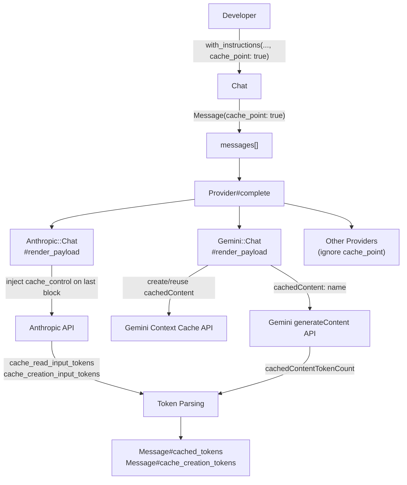

# Design Document: Prompt Caching

## Overview

This feature adds prompt caching support to ruby_llm for Anthropic and Gemini providers. The goal is a minimal, ergonomic API that lets developers mark static portions of their prompts as cache points, reducing input token costs on repeated calls.

The two providers implement caching very differently:

- **Anthropic**: Cache points are expressed as `cache_control: { type: 'ephemeral' }` on the last content block of a message. No separate API call is needed — the provider handles caching transparently.
- **Gemini**: Cache points trigger the Context Caching API, where static content is uploaded as a `cachedContent` resource and referenced by name in subsequent `generateContent` requests.

Both approaches are unified behind the same Ruby API:

```ruby
# Anthropic
chat = RubyLLM.chat(model: 'claude-3-5-sonnet')
  .with_instructions(static_prefix, cache_point: true)
  .with_instructions(session_config, append: true, cache_point: true)

# Gemini
chat = RubyLLM.chat(model: 'gemini-1.5-pro')
  .with_instructions(large_system_prompt, cache_point: true)

chat.ask(user_message)
```

Providers that don't support caching silently ignore the `cache_point` flag.

---

## Architecture



The change surface is intentionally small:

1. `Message` gains a `cache_point` boolean attribute
2. `Chat#with_instructions` and `Chat#ask` accept a `cache_point:` keyword
3. `Anthropic::Chat` injects `cache_control` during payload formatting
4. `Gemini::Chat` manages `cachedContent` lifecycle and payload construction
5. Token parsing is already implemented — just needs the `Message` attribute wiring

---

## Components and Interfaces

### Message

Add `cache_point` as a boolean attribute with a predicate method:

```ruby
attr_reader :cache_point
alias cache_point? cache_point

def initialize(options = {})
  # existing init...
  @cache_point = options.fetch(:cache_point, false)
end
```

`Message#to_h` should include `cache_point: true` only when set, to avoid polluting serialized output.

### Chat

Extend `with_instructions` to accept `cache_point:`:

```ruby
def with_instructions(instructions, append: false, replace: nil, cache_point: false)
  # existing append/replace logic...
  # pass cache_point: cache_point when constructing the Message
end
```

Extend `ask` to accept `cache_point:` for marking the user message:

```ruby
def ask(message = nil, with: nil, cache_point: false, &)
  add_message role: :user, content: build_content(message, with), cache_point: cache_point
  complete(&)
end
```

The internal `append_system_instruction` and `replace_system_instruction` helpers need to forward `cache_point` when constructing `Message` objects.

### Anthropic::Chat

In `build_system_content`, after building the content blocks for a system message, check `msg.cache_point?` and inject `cache_control` on the last block:

```ruby
def build_system_content(system_messages)
  system_messages.flat_map do |msg|
    blocks = # ... existing formatting ...
    inject_cache_control(blocks) if msg.cache_point?
    blocks
  end
end
```

In `format_message` / `format_basic_message_with_thinking`, after building `content_blocks`, inject on the last block if `msg.cache_point?`:

```ruby
def inject_cache_control(blocks)
  return blocks if blocks.empty?
  last = blocks.last
  # Don't duplicate if already present (e.g. Content::Raw with cache_control)
  return blocks if last.is_a?(Hash) && last[:cache_control]
  blocks[-1] = last.merge(cache_control: { type: 'ephemeral' })
  blocks
end
```

The Anthropic API supports up to 4 cache breakpoints per request. Since the formatter processes messages in order and injects on each `cache_point?` message, the caller is responsible for not exceeding 4. The formatter does not enforce this limit — it mirrors the provider's own error response if exceeded.

### Gemini::Chat

Gemini caching is more involved. The `Chat` object needs to store the `cachedContent` name between calls:

```ruby
# In Chat#initialize
@cached_content_name = nil  # Gemini session cache handle
```

The `render_payload` method gains awareness of caching:

```ruby
def render_payload(messages, tools:, temperature:, model:, stream: false,
                   schema: nil, thinking: nil, tool_prefs: nil,
                   cached_content_name: nil)
  # If cached_content_name is set, split messages and use cachedContent field
  # Otherwise, format all messages inline as today
end
```

Because `render_payload` is a module function called by the provider infrastructure, the `cached_content_name` is passed in from the `Chat` object via the provider's `complete` method. The `Chat` object stores it as `@cached_content_name`.

**Cache lifecycle in Gemini::Chat:**

```
complete() called
  └─ has cache_point messages AND model supports caching?
       ├─ YES: @cached_content_name present?
       │         ├─ YES: use it in payload
       │         │         └─ API returns 404? → recreate cache, retry
       │         └─ NO: create cachedContent via Context Cache API
       │                  └─ store name in @cached_content_name
       └─ NO: send full inline payload (log warning if cache_point present but unsupported)
```

**Context Cache API call** (POST `v1beta/cachedContents`):

```json
{
  "model": "models/gemini-1.5-pro",
  "contents": [ /* static messages up to last cache_point */ ],
  "ttl": "3600s"
}
```

Response includes `name` (e.g. `cachedContents/abc123`), stored on `@cached_content_name`.

**generateContent payload with cache:**

```json
{
  "cachedContent": "cachedContents/abc123",
  "contents": [ /* dynamic messages after last cache_point */ ],
  "generationConfig": {}
}
```

The TTL is configurable via `RubyLLM.config` or per-chat:

```ruby
chat.with_params(cache_ttl: 7200)  # override TTL in seconds
```

Default TTL: `3600` seconds.

### Provider Capability Detection

`Anthropic::Capabilities` gains `supports_prompt_caching?`:

```ruby
def supports_prompt_caching?(model_id)
  !model_id.match?(/claude-[12]/)
end
```

`Gemini::Capabilities` already has `supports_caching?` — this is reused as `supports_prompt_caching?` (alias or rename).

Non-supporting providers (OpenAI, etc.) simply don't implement cache point injection in their formatters, so `cache_point` flags are silently ignored.

---

## Data Models

### Message (updated)

| Attribute | Type | Description |
|---|---|---|
| `role` | Symbol | `:system`, `:user`, `:assistant`, `:tool` |
| `content` | String / Content / Content::Raw | Message body |
| `cache_point` | Boolean | Whether this message is a cache breakpoint (default: `false`) |
| `tokens` | Tokens | Token usage including `cached` and `cache_creation` |
| ... | ... | existing attributes unchanged |

### Tokens (unchanged)

Already has `cached` and `cache_creation` attributes. No changes needed.

### Chat (updated)

| Attribute | Type | Description |
|---|---|---|
| `@cached_content_name` | String / nil | Gemini `cachedContent` resource name for session reuse |
| ... | ... | existing attributes unchanged |

### Gemini cachedContent resource

Created via `POST v1beta/cachedContents`. Key fields:

| Field | Type | Description |
|---|---|---|
| `name` | String | Resource name, e.g. `cachedContents/abc123` |
| `model` | String | Model ID, e.g. `models/gemini-1.5-pro` |
| `contents` | Array | Static message content blocks |
| `ttl` | String | Duration string, e.g. `"3600s"` |
| `expireTime` | String | ISO8601 timestamp (returned by API) |

---

## Correctness Properties

*A property is a characteristic or behavior that should hold true across all valid executions of a system — essentially, a formal statement about what the system should do. Properties serve as the bridge between human-readable specifications and machine-verifiable correctness guarantees.*

### Property 1: cache_point? reflects construction flag

*For any* message created with `cache_point: true`, `cache_point?` returns `true`; for any message created without the flag (or with `cache_point: false`), `cache_point?` returns `false`.

**Validates: Requirements 1.2, 1.3, 1.4**

### Property 2: Non-cached payloads are unchanged (invariant)

*For any* list of messages where no message has `cache_point: true`, the provider payload produced by any formatter (Anthropic, Gemini, or other) SHALL be identical to the payload produced before this feature was introduced — no `cache_control`, no `cachedContent` field, no structural changes.

**Validates: Requirements 1.5, 2.5, 5.1**

### Property 3: Anthropic cache_control injection

*For any* message with `cache_point: true` formatted by `Anthropic::Chat`, the last content block in the formatted output SHALL contain `cache_control: { type: 'ephemeral' }`, and no other block in that message SHALL have `cache_control` added by the formatter.

**Validates: Requirements 2.1, 2.2**

### Property 4: Anthropic multiple cache points

*For any* list of N messages where N ≤ 4 have `cache_point: true`, the Anthropic-formatted payload SHALL contain exactly N content blocks with `cache_control: { type: 'ephemeral' }`, each being the last block of its respective cache-pointed message.

**Validates: Requirements 2.3**

### Property 5: Gemini static prefix identification

*For any* list of messages where at least one has `cache_point: true`, the static prefix identified by `Gemini::Chat` SHALL be all messages from the start up to and including the last message with `cache_point: true`, and the dynamic suffix SHALL be all remaining messages.

**Validates: Requirements 3.1**

### Property 6: Gemini cached payload uses cachedContent field

*For any* `Chat` with a non-nil `@cached_content_name`, the `generateContent` payload SHALL include `cachedContent: @cached_content_name` and SHALL NOT include the static prefix messages inline in `contents`.

**Validates: Requirements 3.3**

### Property 7: Gemini TTL configuration

*For any* configured TTL value T, the `cachedContent` creation request SHALL include `ttl: "#{T}s"`. When no TTL is configured, the default SHALL be `"3600s"`.

**Validates: Requirements 3.5**

### Property 8: Gemini unsupported model degrades gracefully

*For any* Gemini model where `supports_caching?` returns `false`, the `render_payload` output SHALL NOT contain a `cachedContent` field, regardless of whether any messages have `cache_point: true`.

**Validates: Requirements 3.6, 5.2**

### Property 9: Cache token parsing round-trip

*For any* provider response containing cache token counts (Anthropic: `cache_read_input_tokens`, `cache_creation_input_tokens`; Gemini: `cachedContentTokenCount`), the parsed `Message` SHALL expose those exact values via `cached_tokens` and `cache_creation_tokens` respectively. When those fields are absent from the response, both SHALL be `nil` (not zero).

**Validates: Requirements 4.1, 4.2, 4.3, 4.4, 4.5**

### Property 10: Capability detection correctness

*For any* model ID, `supports_prompt_caching?` (Anthropic) and `supports_caching?` (Gemini) SHALL return `true` only for models that actually support the respective caching mechanism, and `false` for all others.

**Validates: Requirements 5.3**

---

## Error Handling

**Anthropic exceeding 4 cache breakpoints**: The Anthropic API returns a 400 error if more than 4 `cache_control` blocks are present. ruby_llm does not enforce this limit client-side — the API error propagates as a normal `RubyLLM::Error`. Developers are responsible for staying within the limit.

**Gemini cachedContent expiry (404)**: When a `generateContent` request references an expired or deleted `cachedContent`, the Gemini API returns a 404. The provider catches this, clears `@cached_content_name`, recreates the cache, and retries once. If the retry also fails, the error propagates normally.

**Gemini cache creation failure**: If the `POST v1beta/cachedContents` call fails (e.g., content too short — Gemini requires a minimum token count), the error propagates as a `RubyLLM::Error`. The `@cached_content_name` remains nil.

**Unsupported provider**: Any provider not implementing cache point injection simply ignores `cache_point` flags. No error, no warning.

**Unsupported Gemini model**: Logs a `warn`-level message and falls back to full inline payload. No error raised.

**Gemini minimum token requirement**: Gemini's Context Caching API requires the cached content to be at least 32,768 tokens (for most models). If the static prefix is too short, the API returns an error. This is surfaced as a `RubyLLM::Error` with the provider's message.

---

## Testing Strategy

### Unit Tests

Focus on specific examples, edge cases, and error conditions:

- `Message` with and without `cache_point:` flag
- `Anthropic::Chat#render_payload` with a single cache-pointed system message
- `Anthropic::Chat#render_payload` with multiple cache-pointed messages
- `Anthropic::Chat#render_payload` with `Content::Raw` already containing `cache_control` (no duplication)
- `Gemini::Chat` static prefix extraction logic
- `Gemini::Chat#render_payload` with `cached_content_name` set
- `Gemini::Chat#render_payload` with unsupported model (no `cachedContent` field, warning logged)
- Token parsing: Anthropic response with `cache_read_input_tokens` and `cache_creation_input_tokens`
- Token parsing: Gemini response with `cachedContentTokenCount`
- Token parsing: response without cache fields → `nil` values

### Property-Based Tests

Use [rantly](https://github.com/rantly-rb/rantly) or [propcheck](https://github.com/nicholaides/propcheck) for property-based testing. Each test runs a minimum of 100 iterations.

**Property 1 — cache_point? reflects construction flag**
```
# Feature: prompt-caching, Property 1: cache_point? reflects construction flag
property: for all (role, content, flag) → Message.new(role:, content:, cache_point: flag).cache_point? == flag
```

**Property 2 — Non-cached payloads are unchanged**
```
# Feature: prompt-caching, Property 2: Non-cached payloads are unchanged (invariant)
property: for all message lists with no cache_point messages →
  Anthropic::Chat.render_payload(messages, ...) == render_payload_without_feature(messages, ...)
```

**Property 3 — Anthropic cache_control injection**
```
# Feature: prompt-caching, Property 3: Anthropic cache_control injection
property: for all messages with cache_point: true →
  last block of formatted message has cache_control: { type: 'ephemeral' }
  AND no other block has cache_control added
```

**Property 4 — Anthropic multiple cache points**
```
# Feature: prompt-caching, Property 4: Anthropic multiple cache points
property: for all message lists with N (1..4) cache-pointed messages →
  count of cache_control blocks in payload == N
```

**Property 5 — Gemini static prefix identification**
```
# Feature: prompt-caching, Property 5: Gemini static prefix identification
property: for all message lists with at least one cache_point message →
  static_prefix == messages[0..last_cache_point_index]
  dynamic_suffix == messages[(last_cache_point_index+1)..]
```

**Property 6 — Gemini cached payload uses cachedContent field**
```
# Feature: prompt-caching, Property 6: Gemini cached payload uses cachedContent field
property: for all cached_content_name strings and dynamic message lists →
  payload[:cachedContent] == cached_content_name
  AND static messages are absent from payload[:contents]
```

**Property 7 — Gemini TTL configuration**
```
# Feature: prompt-caching, Property 7: Gemini TTL configuration
property: for all positive integer TTL values T →
  cache creation request body includes ttl: "#{T}s"
```

**Property 8 — Gemini unsupported model degrades gracefully**
```
# Feature: prompt-caching, Property 8: Gemini unsupported model degrades gracefully
property: for all unsupported Gemini model IDs and any message list →
  render_payload output does not contain :cachedContent key
```

**Property 9 — Cache token parsing round-trip**
```
# Feature: prompt-caching, Property 9: Cache token parsing round-trip
property: for all non-negative integers (cached, cache_creation) →
  parsed_message.cached_tokens == cached
  AND parsed_message.cache_creation_tokens == cache_creation
  AND for responses without those fields → both are nil
```

**Property 10 — Capability detection correctness**
```
# Feature: prompt-caching, Property 10: Capability detection correctness
property: for all known Anthropic model IDs →
  supports_prompt_caching?(id) == (id does not match /claude-[12]/)
property: for all known Gemini model IDs →
  supports_caching?(id) matches the known support matrix
```

### Integration Tests (VCR Cassettes)

- Anthropic: full round-trip with `cache_point: true` on system message, verify `cache_creation_input_tokens` in response
- Anthropic: second call to same chat, verify `cache_read_input_tokens` in response
- Gemini: first call creates `cachedContent`, stores name on Chat
- Gemini: second call reuses `cachedContent` name in payload
- Gemini: expired cache (404) triggers recreation and retry
